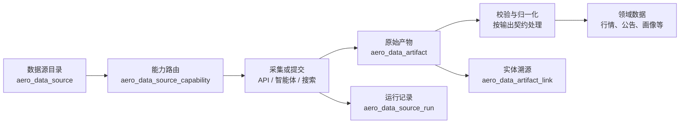

# 统一数据源架构

## 目标

系统不以“AKShare 脚本”“Hermes 脚本”作为架构边界，而以数据能力和数据契约作为边界。任何 API、人工、智能体或网页搜索渠道都可以接入，但只有经过校验、归一化和溯源关联的数据才能写入领域表。



## 四类核心对象

| 对象 | 表 | 用途 |
| --- | --- | --- |
| 数据源 | `aero_data_source` | 描述渠道本身，例如 AKShare、BaoStock、Hermes。 |
| 数据能力 | `aero_data_source_capability` | 描述该渠道能提供什么，例如行情、公告或业务暴露证据，以及优先级。 |
| 运行记录 | `aero_data_source_run` | 记录一次拉取或一次智能体提交：发现多少产物、提出多少候选、采纳多少记录。 |
| 原始产物 | `aero_data_artifact` | 保存来源链接、哈希、发布日期和采集元数据；通过 `aero_data_artifact_link` 关联到领域实体。 |

## 输出契约

当前支持两类契约：

- `raw_data`：面向结构化 API 的原始字段，例如行情、财务、公告元数据。由对应适配器转换为领域表字段。
- `research_bundle`：面向 Hermes、网页搜索或未来其他研究智能体。必须提交候选 JSON、逐条证据 JSON、研究摘要和完成状态；先进入 `data/research/<topic>/` 待审核区，再由导入器校验并采纳。
- `derived_data`：面向本地规则、聚合和报告任务。它只能从已入库的原始数据推导结果，不能冒充新的外部证据。

文件、字段和状态的精确格式见 [研究包输出契约](RESEARCH-BUNDLE-CONTRACT.md)。

渠道的可信度不等于单条事实的可信度。比如 Hermes 是“采集渠道”，巨潮公告才是原始证据来源：前者记录在数据源运行和产物表，后者保存在画像证据的 `source_name/source_url` 中。

## 已接入渠道

| 数据源键 | 类型 | 主要能力 | 接入状态 |
| --- | --- | --- | --- |
| `akshare` | API | 行情、公告、概念、行业 | 已启用 |
| `baostock` | API | 行情、行业、季频盈利能力 | 已启用 |
| `hermes_research_agent` | 智能体 | 商业航天业务暴露取证 | 已启用 |
| `local_data_pipeline` | 本地处理 | 事件抽取、板块聚合、盘后日报 | 已启用 |
| `web_research_connector` | 搜索 | 商业航天业务暴露取证 | 预留 |

## 新数据源接入步骤

1. 在 `scripts/data-sources.ts` 注册渠道元数据和能力；不保存密钥。
2. 选择或新增输出契约。跨智能体检索优先复用 `research_bundle`，避免每个智能体发明一套格式。
3. 编写连接器/导入器。连接器只负责采集或接收，领域导入器负责校验、去重和写业务表。
4. 创建 `aero_data_source_run`，保存所有原始产物，并用 `aero_data_artifact_link` 关联被采纳的业务实体。
5. 在失败、无数据和部分成功时也完成运行记录，方便页面和调度器判断真实状态。

## 调度器如何接入

同步任务不是另一套来源模型。`server/index.ts` 的每个任务都声明 `dataSource.key` 和 `capabilityKey`：启动时由调度器创建 `aero_data_source_run`，结束时回填状态、告警和写入数量。这样后续新增 API、搜索连接器或智能体时，只需注册来源、声明契约，再将任务映射到该能力即可。

Hermes 是例外：研究包导入器本身会按“候选—证据—实体关联”粒度记录运行和原始产物，因此调度器只负责启动与展示，不再创建一条重复的来源运行记录。

当前行情、公告等既有脚本已统一登记运行状态和写入数量；其原始响应落 `aero_data_artifact` 的迁移可按能力逐个补齐，不能用“有运行记录”替代原始证据留存。

## 智能体派发提示词

智能体提示词也属于数据源配置，而不是聊天记录。Hermes 的正式、可迁移版本保存在 [`docs/agent-prompts/hermes-space-exposure.md`](agent-prompts/hermes-space-exposure.md)，含版本号、输入输出路径、证据标准和完成条件。数据源管理页面可直接查看并复制这份提示词；换环境时只需带上项目，即可恢复相同的派发任务。

同步中心的“渠道控制面”会展示数据源状态、能力、最近一次运行和写入数；若目录为空，先执行初始化命令。

## 初始化与查询

```bash
pnpm db:schema
pnpm seed:data-sources
```

数据源目录可由 `GET /api/data-sources` 查询。Hermes 的商业航天取证导入会自动登记本次数据源运行、原始证据产物与画像证据关联；没有可采纳候选的“无新增证据”运行也会被记录为成功。
